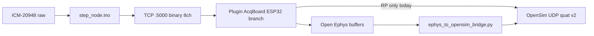

# ESP32-S3 Multi-Node Acquisition (STEP Extension)

## What This Is

Firmware and host tooling to add **Seeed Studio XIAO ESP32-S3** nodes to the **STEP** gait / rehabilitation pipeline. Each node acquires **ICM-20948 IMU** and **DIO**, streams **Open Ephys–compatible** TCP packets, and integrates with the **Minkeejung0415/Plugin** **AcqBoardRedPitaya** acquisition board—the same stack used for **Red Pitaya** and **OpenSim** motion.

**Current milestone (v2.0):** The acquisition board can connect and stream raw IMU, but **sensor configuration**, **sample-rate control**, **orientation (quaternion) filtering**, and **OpenSim movement** do not match the Red Pitaya experience. OpenSim appears wrong because **no quaternion values** reach the motion pipeline.

## Core Value

**Time-aligned orientation-aware motion data** (not just raw accel/gyro) at STEP-compatible rates so **Plugin acquisition**, **sensor configuration UI**, and **OpenSim** produce physically plausible movement—parity with Red Pitaya quaternion + filter behavior where the lab depends on it.

## Requirements

### Validated

- ✓ **ICM-20948 @ 100 Hz (Arduino)** — `arduino/step_node/step_node.ino` WHO_AM_I, burst read, synthetic fallback
- ✓ **DIO on ch6** — debounced level + edge count in int16
- ✓ **Open Ephys binary packet layout** — 22-byte LE header + 8×int16
- ✓ **Plugin AcqBoard TCP connect + 8-ch stream (raw)** — local Plugin `e298679` + firmware handshake; review `.planning/reviews/plugin-esp32-REVIEW.md`
- ✓ **USB lab paths** — `host/serial_tcp_bridge.py` (`--plugin`), `host/esp32_tcp_client.py`
- ✓ **Handshake text (partial RP parity)** — `OK CHANNELS:8`, `STARTED`, `SENSORS:0,ICM20948` on Arduino + bridge

### Active (v2.0 milestone)

1. [ ] **Sensor configuration** — Plugin UI / `CFG` (and related) commands change ESP32 ICM scaling, ranges, or filter presets end-to-end
2. [ ] **Sample rate** — `FREQ:` (or equivalent) from acquisition board updates firmware loop rate with UI feedback (not silent no-op)
3. [ ] **Quaternion filter** — onboard or agreed host-side orientation filter; quaternion(s) in stream or dedicated OpenSim path
4. [ ] **OpenSim movement** — quaternion UDP v2 (or bridge equivalent) populated from ESP32 path, not accel-only guesswork
5. [ ] **Documentation** — channel map, command matrix, OpenSim runbook updated for quat layout

### Deferred (unchanged)

- [ ] **ESP-NOW** multi-node sync — after orientation + OpenSim sign-off
- [ ] **SD** session logging — after streaming + config stable
- [ ] **Camera** — v2 / out of milestone

### Out of Scope (current milestone)

- Replacing Red Pitaya firmware or changing RP quaternion path
- Full dynamic multi-sensor layout like RP `SENSORS:` expansion (single ICM20948 node is sufficient if quat + CFG work)
- Medical certification
- Implementing Plugin C++ **only** in ESP32-S3 repo (Plugin repo PRs tracked externally)

## Context

### What works today

| Layer | Behavior | Evidence |
|-------|----------|----------|
| **Firmware stream** | 100 Hz fixed; ch0–5 raw ICM int16; ch6 DIO; **ch7 = 0** | `step_node.ino:726-734` |
| **TCP commands** | `REDPITAYA`, `START`, `STATUS` only | `step_node.ino:382-395` — **no `FREQ:`, `FILTER`, `CFG`** |
| **ICM init** | PWR_MGMT_1 only; no DMP/AHRS | `step_node.ino:261-278` |
| **Plugin ESP32 path** | TCP binary after `START`; scaling presets; rate clamped 100 Hz in C++ | `.planning/reviews/plugin-esp32-REVIEW.md` MD-04 |
| **Plugin OpenSim** | `sendOpenSimQuaternionPacket()` **only on RP UDP branch** | plugin-esp32-REVIEW HI-02 |
| **Bridge scripts** | `OPENSIM_ESP32_8CH=1` renames sensor only; **no quat parsing** | plugin-esp32-REVIEW LO-03 |

### User-reported gap (2026-06-03)

> Can use the acquisition board, but no interactions with sensor configuration, sample rate, filter quaternion. No filter added. OpenSim movement very wrong—no quaternion values.

### Architecture (data path)

**Break:** ESP32 branch never produces quaternion samples; firmware never runs orientation filter.

## Constraints

- **Plugin repo is primary** for acquisition UI and OpenSim launch; ESP32-S3 repo owns firmware + host bridge + docs.
- **Do not break** default single-board bench: `ENABLE_ESPNOW false`, sensible USB/Wi-Fi presets.
- **Red Pitaya regression:** RP must keep UDP 55001, `FREQ`/`FILTER`/`CFG`, and existing OpenSim quaternion forwarding (`plugin-esp32-REVIEW` regression table).
- **Channel budget:** Extending beyond 8 int16 channels requires coordinated Plugin + Open Ephys layout decision (prefer explicit versioned map doc).

## Key Decisions

| Decision | Rationale | Outcome |
|----------|-----------|---------|
| Arduino `step_node.ino` first for fusion/CMD | Lab iteration speed | — Pending |
| Quaternion source TBD: **on-device AHRS** vs **Plugin host fusion** | RP uses firmware fusion + quat tail; ESP32 has neither | — **Assumption: on-device Madgwick/Mahony** unless user prefers Plugin-only |
| Keep 8-ch map if quat fits ch7+wxyz split OR expand channels | OpenSim expects quat UDP v2 | — Pending design in Phase 2 |
| Plugin + firmware both implement `FREQ`/`CFG` subset | UI commands must not be no-ops | — Pending |
| Prior milestone streaming work remains valid | Brownfield | ✓ Baseline |

## Assumptions (documented — confirm with user)

1. **“Filter quaternion”** = orientation filter output (w,x,y,z) for OpenSim, not only gyro high-pass.
2. **Target sample rates:** 50–200 Hz supported with 100 Hz default (match Plugin clamp today).
3. **Single ICM sensor** index 0 in `SENSORS:` line is enough for v2.
4. **OpenSim fix** requires quaternion packets, not scaling raw accel alone.
5. **Interactive approval skipped** — YOLO-style defaults in `config.json`; milestone scope as stated in problem statement.

## Evolution

This document evolves at phase transitions and milestone boundaries.

**After each phase transition** (via `/gsd-transition`):
1. Requirements invalidated? → Move to Out of Scope with reason
2. Requirements validated? → Move to Validated with phase reference
3. New requirements emerged? → Add to Active
4. Decisions to log? → Add to Key Decisions
5. "What This Is" still accurate? → Update if drifted

---
*Last updated: 2026-06-03 after /gsd-new-project — v2.0 sensor config, quaternion filter, OpenSim*
