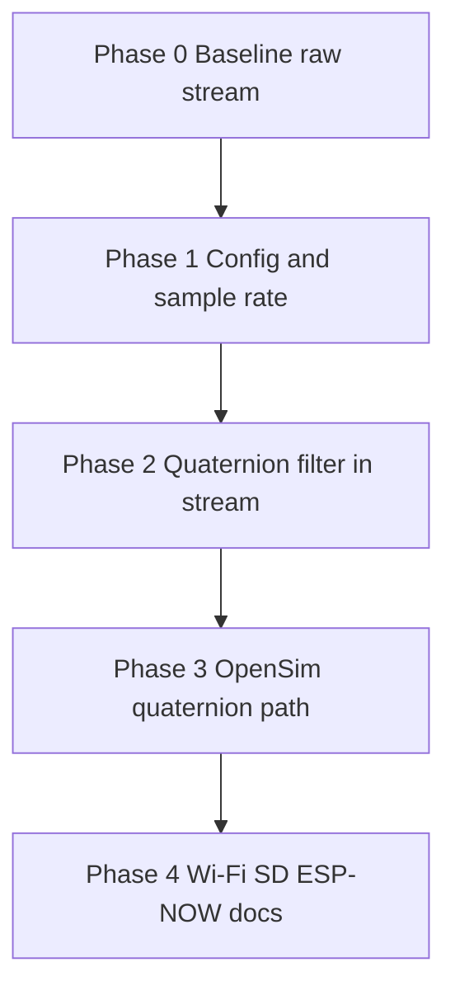

# Roadmap — ESP32-S3 STEP Acquisition

**Milestone:** v2.0 — Sensor config, quaternion filter, OpenSim correctness  
**Prior milestone:** v1.0 raw 8-ch Plugin streaming (baseline complete in code)  
**Phases:** Config & rate → Fusion & quaternions → OpenSim → Hardening & deferred features

## Dependency graph

---

## Phase 0: Baseline (complete)

**Goal:** Raw ICM + DIO @ 100 Hz into Plugin AcqBoard over TCP/USB bridge.

**Requirements:** SENS-ICM-01..03, SENS-DIO-01..02, STREAM-OE-01..03, STREAM-PLUGIN-01 (raw)  
**Status:** ✓ Code complete; hardware sign-off optional

**Key files:** `arduino/step_node/step_node.ino`, `host/serial_tcp_bridge.py`, `host/esp32_tcp_client.py`, Plugin `acqboard.ccp` @ `e298679`

---

### Phase 1: Sensor configuration & sample rate (Plugin UI ↔ firmware)
**Goal:** Acquisition board UI commands for **sensor presets** and **sample rate** actually change ESP32 behavior and are visible in stream metadata.

**Mode:** mvp  
**Requirements:** CFG-01..04, RATE-01..03  
**Depends on:** Phase 0  
**Success Criteria:**
1. Sending documented `CFG:` preset from Plugin (or `esp32_tcp_client.py` test harness) changes ICM full-scale; ch0–5 scale in host matches preset
2. `FREQ:50` / `FREQ:100` / `FREQ:200` (allowed set TBD) changes measured frame rate ±2 Hz
3. Plugin sample-rate control shows fixed rate OR applies FREQ—documented, no editable no-op
4. `docs/open-ephys-plugin.md` lists supported TCP text commands for ESP32

**Implementation notes (from codebase):**
- Add `handleLine()` branches in `step_node.ino` mirroring RP command names (`FREQ:`, `FILTER:`, `CFG:`) — today only `REDPITAYA`/`START` (`step_node.ino:382-395`)
- Plugin repo: ESP32 branch must not return before FREQ/CFG handlers (today RP-only per review)
- USB bridge: forward text commands from Plugin TCP to serial when in `--plugin` mode (if not already bidirectional)

---

### Phase 2: Quaternion orientation filter in the data path
**Goal:** Add a **filter quaternion** pipeline so motion state is orientation, not raw gyro integration only.

**Mode:** mvp  
**Requirements:** FUSION-01..04  
**Depends on:** Phase 1 (rate + ICM ranges stable)  
**Success Criteria:**
1. Filter outputs unit quaternion; norm |q|≈1 within 0.01 during static test
2. Known 90° rotation test produces expected quaternion change (documented tolerance)
3. `FILTER:` command enables/disables or selects mode per runbook
4. Wire format documented: channel indices for w,x,y,z (or expanded channel count with Plugin map update)
5. 60 s soak @ target rate: <5% dropped frames USB + Wi-Fi

**Implementation notes:**
- Today `channels[7] = 0` always (`step_node.ino:734`); no fusion in `initIcm20948()`
- Prefer lightweight AHRS on ESP32 (CPU budget at 100 Hz); ICM DMP optional if wiring/library allows
- Coordinate frame documented (sensor vs world) for OpenSim

---

### Phase 3: OpenSim movement with valid quaternions
**Goal:** OpenSim receives **quaternion values** from ESP32 acquisition path; movement is not “wrong” due to missing quat.

**Mode:** mvp  
**Requirements:** OSIM-01..04, HOST-04..05  
**Depends on:** Phase 2  
**Success Criteria:**
1. Plugin **Gen Motion / Live** with ESP32 node sends OpenSim UDP packets containing non-zero quaternion components during motion
2. Bridge scripts work with documented ESP32 quat map (`OPENSIM_ESP32_8CH` or successor flag)
3. Recorded session → bridge → OpenSim reproduces orientation change
4. `.planning/PLUGIN-INTEGRATION.md` checklist includes OpenSim quaternion sign-off

**Implementation notes:**
- **HI-02** in `.planning/reviews/plugin-esp32-REVIEW.md`: ESP32 TCP `run()` never calls `sendOpenSimQuaternionPacket()` — fix in Plugin repo
- `ephys_to_opensim_bridge.py`: extend beyond sensor name map (LO-03)
- Align with Red Pitaya UDP v2 layout where possible for script reuse

---

### Phase 4: Production hardening & deferred v1 items
**Goal:** Wi-Fi stability, SD, docs, optional ESP-NOW / ESP-IDF—after orientation path proven.

**Requirements:** STREAM-OE-05, SD-01..03, SYNC-01..04, HOST-03, FW-01, SENS-ICM-04  
**Depends on:** Phase 3  
**Success Criteria:**
1. Wi-Fi TCP <5% drop / 60 s @ configured rate
2. SD logging does not starve stream (if enabled)
3. README + operator docs aligned with v2 command/quat matrix

---

## Progress

| Phase | Status |
|-------|--------|
| 0 Baseline raw stream | **Complete** (code) |
| 1 Config + sample rate | **Complete** (code; HIL optional) |
| 2 Quaternion filter | **Complete** (code; motion HIL optional) |
| 3 OpenSim quaternions | **Complete** (Plugin code; E2E HIL optional) |
| 4 Hardening / deferred | **Complete** (docs); SD/Wi-Fi soak deferred |

## Out of near-term roadmap

- **Camera** (v2) — `docs/camera-feasibility.md`
- **Native Plugin C++ in ESP32-S3 repo** — external Plugin only

---
*Last updated: 2026-06-03 — v2.0 roadmap; top phases 1–3 address user problem statement*
