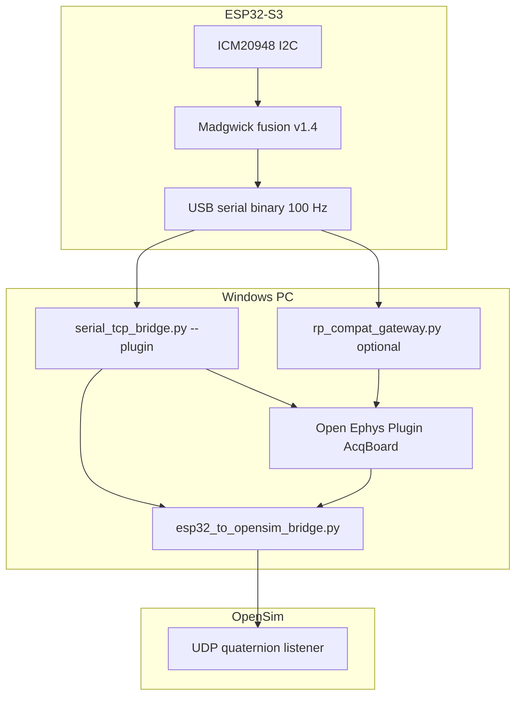

# ESP32-S3 → Open Ephys → OpenSim — Integration Checklist

**Purpose:** Single list of everything required for lab use with the custom **Minkeejung0415/Plugin** Acquisition Board, on-device **filter + quaternions**, and **OpenSim** live motion — including what is already done vs still pending.

**Related docs:**

| Doc | Topic |
|-----|--------|
| [arduino-ide-guide.md](arduino-ide-guide.md) | Flash, USB, Wi-Fi, wiring |
| [open-ephys-plugin.md](open-ephys-plugin.md) | Plugin vs Ephys Socket comparison |
| [esp32-fusion-and-opensim.md](esp32-fusion-and-opensim.md) | v1.4 channel map + quick commands |
| [../plugin-patches/MANUAL.md](../plugin-patches/MANUAL.md) | Minimal Plugin C++ edits |
| [../plugin-patches/hosts.txt](../plugin-patches/hosts.txt) | `rp-f0f85a.local` → `127.0.0.1` |

---

## Status at a glance

| Layer | What you need | On `main` today | Action |
|-------|----------------|-----------------|--------|
| **USB → TCP bridge** | Parse firmware binary, `--plugin` handshake | Partial — **bit_depth=16 bug** | Merge [PR #3](https://github.com/Minkeejung0415/ESP32-S3/pull/3) or use branch `cursor/serial-bridge-bitdepth-fix-4db7` |
| **Firmware v1.4** | 11 ch, Madgwick, filter, quats ch7–10 | **Missing** (main = v1.3.0, 8 ch) | Re-merge / flash from commit `645ef29` or branch `cursor/esp32-fusion-filter-opensim-4db7` |
| **Sample rate** | 100 Hz end-to-end | Firmware fixed 100 Hz | Set Open Ephys acquisition rate to **100 Hz**; match Plugin |
| **Sensor config** | ICM20948 scaling + `SENSORS:` line | Raw int16; bridge sends `SENSORS:0,ICM20948` | Plugin scaling or gateway; see § Plugin |
| **Filter** | Gravity-removed accel ch0–2 | **Not on main firmware** | Flash v1.4 + `FILTER_PERMANENT` |
| **Quaternions** | ch7–10 → OpenSim | **Not on main firmware** | Flash v1.4 + use OpenSim bridge |
| **Plugin transport** | TCP samples or UDP :55001 | Plugin expects Red Pitaya UDP | Gateway **or** patch `acqboard.ccp` |
| **OpenSim movement** | Correct quat map + UDP port | Bridge script in repo; needs v1.4 data | § OpenSim + axis verification |

---

## What was fixed recently (USB acquisition only)

The **`no serial frames yet — no valid Open Ephys header`** failure was **not** sensor/filter/OpenSim — it was the host bridge rejecting `bit_depth=16` in the Open Ephys header.

| Before fix | After fix |
|------------|-----------|
| Handshake/START OK, zero samples on TCP | USB frames parsed and forwarded |
| Open Ephys shows flat / no data | Samples can reach Plugin |

**Does not fix:** wrong scale, wrong quaternion axes, filter off, 8 vs 11 channel mismatch, Plugin still reading UDP while only TCP has data.

---

## End-to-end architecture



**Pick one Plugin data path:**

1. **USB + TCP only** — `serial_tcp_bridge.py COMx --plugin` → Plugin @ `127.0.0.1:5000` (requires Plugin patch **or** stock Plugin if it reads TCP after START).
2. **USB + gateway (no Plugin rebuild)** — `rp_compat_gateway.py COMx` → TCP `:5000` + UDP `:55001` + `hosts.txt` → Plugin connects to `rp-f0f85a.local`.
3. **Wi-Fi** — `ENABLE_TCP true` on ESP32 → Plugin/Ephys Socket @ board IP (no USB bridge).

---

## 1. Firmware changes (`arduino/step_node/`)

**Target:** v1.4.x as merged in `645ef29` (not current `main` v1.3.0).

### 1.1 Required files

| File | Role |
|------|------|
| `step_node.ino` | Main sketch: 11 ch, presets, TCP/serial stream |
| `imu_fusion.h` | Madgwick AHRS, gravity removal, quat → int16 |

Copy both into the same Arduino sketch folder. **Do not** upload `.ino` alone without `imu_fusion.h`.

### 1.2 Required `#define`s (v1.4)

| Setting | USB + Plugin (your case) | Wi-Fi + Plugin |
|---------|--------------------------|----------------|
| `USB_OPEN_EPHYS_MODE` | `true` | `false` |
| `ENABLE_TCP` | `false` | `true` |
| `ENABLE_SERIAL_BENCH` | `true` | `false` |
| `SERIAL_OUTPUT_BINARY` | `true` | `false` |
| `NUM_CHANNELS` | **11** | **11** |
| `SAMPLE_HZ` | **100** | **100** |
| `FILTER_PERMANENT` | **true** (ch0–2 filtered accel) | same |
| `FIRMWARE_VERSION` | `1.4.1` (or later) | same |

### 1.3 Channel map (must match host + OpenSim)

| Ch | Content | Notes |
|----|---------|--------|
| 0–2 | Linear accel (gravity removed when filter on) | int16; scale in Plugin if needed |
| 3–5 | Raw gyro | int16 |
| 6 | DIO (bit0 = level, bits1–15 = edge count) | |
| 7–10 | Quaternion **w, x, y, z** | int16 ÷ **32767** → float |

### 1.4 Optional firmware improvements

| Change | Why |
|--------|-----|
| `fillOeHeader(): bit_depth = 3` instead of `16` | Stricter Open Ephys header enum (bridge already normalizes 16→3) |
| Reply `OK CHANNELS:11\n` on serial when receiving `REDPITAYA` | Helps debug without TCP |
| ICM DLPF / range registers in `initIcm20948()` | Match Red Pitaya noise bandwidth if motion looks wrong |
| `USB_OPEN_EPHYS_MODE` default on `main` | Avoid flashing wrong preset |

### 1.5 Verification (firmware)

```powershell
python host\serial_bench_reader.py COMx --binary --limit 20
```

After **>5 s** from reset, expect repeating binary frames; header `num_channels=11`, `num_bytes=22`.

---

## 2. Host / PC changes (`host/`)

### 2.1 Required

| Item | Command / file | Status |
|------|----------------|--------|
| Merge bridge fix | `serial_tcp_bridge.py` from PR #3 | **Pending on `main`** |
| Channel env | `set ESP32_NUM_CHANNELS=11` | Must match firmware |
| Close Serial Monitor | Before any bridge | Always |
| Boot delay | Wait **>5 s** after reset | `BOOT_CSV_DELAY_MS` |

```powershell
pip install pyserial
set ESP32_NUM_CHANNELS=11
python host\serial_tcp_bridge.py COMx --plugin
```

### 2.2 Plugin path without C++ rebuild (recommended)

| Step | Action |
|------|--------|
| 1 | Add line from `plugin-patches/hosts.txt` to `C:\Windows\System32\drivers\etc\hosts` (admin) |
| 2 | `python host\rp_compat_gateway.py COMx` |
| 3 | Open Ephys Plugin → connect to **`rp-f0f85a.local`** (resolves to 127.0.0.1) |

Gateway provides: TCP handshake on **5000**, UDP stream on **55001**, `STARTED` + `SENSORS:0,ICM20948`.

### 2.3 Plugin path with USB bridge only

| Step | Action |
|------|--------|
| 1 | `python host\serial_tcp_bridge.py COMx --plugin` |
| 2 | Open Ephys → Node IP **`127.0.0.1`**, port **5000** |
| 3 | Plugin must read **TCP** frames after START (see § Plugin patch) |

Wrapper: `host\run_usb_plugin_bridge.ps1 COMx`

### 2.4 OpenSim path

| Step | Action |
|------|--------|
| 1 | Start USB bridge or gateway (data on `127.0.0.1:5000`) |
| 2 | `set ESP32_NODE_HOST=127.0.0.1` |
| 3 | `set OPENSIM_UDP_PORT=<your OpenSim listener port>` |
| 4 | `python host\esp32_to_opensim_bridge.py` |

See [esp32-fusion-and-opensim.md](esp32-fusion-and-opensim.md).

### 2.5 Host verification

| Test | Pass criterion |
|------|----------------|
| Bridge log | `first Open Ephys frame from serial` (not `no serial frames yet`) |
| `esp32_tcp_client.py` | Handshake + increasing sample count @ 100 Hz |
| OpenSim bridge | Log `sent N quaternions` every 500 frames |

---

## 3. Plugin changes (Minkeejung0415/Plugin — your machine)

The Plugin repo is **not** in this firmware repo. Apply **one** of the following.

### Path A — No C++ rebuild (gateway + hosts)

| # | Change | Where |
|---|--------|--------|
| A1 | `127.0.0.1 rp-f0f85a.local` | Windows `hosts` file |
| A2 | Run `host/rp_compat_gateway.py` | This repo |
| A3 | Connect Plugin to `rp-f0f85a.local` | Open Ephys GUI |

**No edits** to `acqboard.ccp`.

### Path B — Minimal C++ patch (USB bridge or Wi-Fi TCP)

Documented in [plugin-patches/MANUAL.md](../plugin-patches/MANUAL.md). Summary:

| # | Change | File | Purpose |
|---|--------|------|---------|
| B1 | Add `127.0.0.1` to host list | `acqboard.ccp` | Reach ESP32 / bridge |
| B2 | `esp32TcpStream` + read frames in `run()` from **TCP** | `acqboard.ccp` | Data after START (not UDP 55001 only) |
| B3 | Skip / shorten `SENSORS:` wait; `numAdcChannels = 11` | `acqboard.ccp` | Avoid stall; match fusion layout |

Auto-patcher: `python scripts/patch_plugin_esp32.py --plugin-dir C:\path\to\Plugin`

### Path C — Stock Ephys Socket (no custom Plugin)

| # | Change |
|---|--------|
| C1 | `ENABLE_TCP true` on ESP32, join Wi-Fi |
| C2 | Open Ephys built-in **Ephys Socket** → board IP:5000 |
| C3 | No filter/quat in Plugin UI — raw 8 ch on main firmware only |

### 3.1 Sensor configuration & scaling (why traces look wrong)

| Issue | Cause | Fix |
|-------|--------|-----|
| Accel/gyro wrong units | Plugin applies Red Pitaya **sensor presets** to raw int16 | Fixed scale for ESP32: ±2 g accel (16384 LSB/g), ±250 °/s gyro (131 LSB/(°/s)) — see `imu_fusion.h` |
| Wrong channel count | Plugin expects dynamic layout from `SENSORS:` | Force **11** ch for fusion; **8** only for legacy main sketch |
| ch6 misinterpreted | DIO packed word | Treat as digital + edge counter, not analog |
| Filter button no effect | Filter on **device** in v1.4 (`FILTER_PERMANENT`) | No Plugin filter button required |
| Quat channels empty | 8 ch firmware / ch7=0 | Flash v1.4 11 ch |

### 3.2 Sample rate

| Location | Value |
|----------|--------|
| Firmware `SAMPLE_HZ` | **100** |
| Handshake text | `sample_rate=100` |
| Open Ephys acquisition | Set GUI to **100 Hz** |
| OpenSim bridge | One UDP quat per sample (~100 Hz) |

If motion plays too fast/slow in OpenSim, check OpenSim **time step** vs UDP rate, not just ESP32.

---

## 4. OpenSim changes (why movement is wrong)

OpenSim issues are **downstream** of correct 11 ch fusion data.

### 4.1 Required setup

| # | Item |
|---|------|
| 1 | Firmware v1.4 streaming quats on ch7–10 |
| 2 | TCP path to `127.0.0.1:5000` (bridge or gateway) |
| 3 | `esp32_to_opensim_bridge.py` running |
| 4 | `OPENSIM_UDP_PORT` matches your OpenSim / Plugin listener |

### 4.2 Common causes of wrong motion

| Symptom | Likely cause | What to change |
|---------|--------------|----------------|
| No rotation | ch7–10 zero (8 ch firmware) | Flash v1.4 |
| Wild spin | Quat not normalized / wrong scale | Check int16 ÷ 32767; verify Madgwick running |
| Wrong axis | Body vs world frame | Add axis remap in `esp32_to_opensim_bridge.py` (swap/sign qx,qy,qz) |
| 90° offset | IMU mount vs OpenSim model | Calibrate with known 90° board rotation test |
| Jitter | USB timing | Acceptable at 100 Hz; try Wi-Fi TCP for comparison |
| Frozen | OpenSim not listening on UDP port | Fix `OPENSIM_UDP_PORT` |

### 4.3 Calibration procedure (recommended)

1. Flash v1.4, run bridge, confirm 11 ch in Open Ephys.
2. Place board flat; note quat (expect ~identity for chosen frame).
3. Rotate **+90°** about one body axis; verify one quaternion component moves dominantly in OpenSim.
4. Adjust remap in `esp32_to_opensim_bridge.py` until OpenSim matches physical rotation.

### 4.4 Optional OpenSim / Plugin repo scripts

The Plugin repo may include `ephys_to_opensim_bridge.py` / `opensim_live_realtime.py` for Red Pitaya layouts. For ESP32, prefer **`host/esp32_to_opensim_bridge.py`** (ch7–10 fixed map).

---

## 5. Merge & repo hygiene (this GitHub repo)

`main` currently lags the integrated stack. Recommended merge order:

| Order | Branch / commit | Brings |
|-------|-----------------|--------|
| 1 | PR #3 `cursor/serial-bridge-bitdepth-fix-4db7` | USB `bit_depth=16` fix, `--plugin` |
| 2 | Re-apply `645ef29` firmware + `imu_fusion.h` | 11 ch, filter, quats |
| 3 | Keep `host/rp_compat_gateway.py`, `esp32_to_opensim_bridge.py`, `plugin-patches/` | Documented in this checklist |
| 4 | Restore `docs/local-open-ephys-setup.md` if needed | Windows lab setup |

**Do not break:** 6-channel legacy clients — use `ESP32_NUM_CHANNELS=8` only when running legacy 8 ch firmware.

---

## 6. Master checklist (printable)

### Phase A — Data reaches Open Ephys

- [ ] Flash v1.4 (`imu_fusion.h` + `step_node.ino`, `USB_OPEN_EPHYS_MODE true`)
- [ ] Wait >5 s after boot; Serial Monitor closed
- [ ] Updated `serial_tcp_bridge.py` (PR #3)
- [ ] `set ESP32_NUM_CHANNELS=11`
- [ ] `python host\serial_tcp_bridge.py COMx --plugin` **or** `rp_compat_gateway.py`
- [ ] Bridge log: `first Open Ephys frame from serial`
- [ ] Open Ephys: 100 Hz, 11 channels, live traces

### Phase B — Plugin sensor layout

- [ ] Path A (gateway + hosts) **or** Path B (patch `acqboard.ccp`)
- [ ] ch0–2 show filtered accel when moving board
- [ ] ch3–5 gyro responds
- [ ] ch6 DIO toggles when D0 grounded

### Phase C — OpenSim

- [ ] ch7–10 non-zero when rotating board
- [ ] `esp32_to_opensim_bridge.py` → correct UDP port
- [ ] Known rotation test passes
- [ ] Axis remap applied if needed

---

## 7. Quick reference — environment variables

| Variable | Default | Use |
|----------|---------|-----|
| `ESP32_NUM_CHANNELS` | `11` | Handshake + parsing |
| `SERIAL_PORT` / `COMx` | — | USB port |
| `BRIDGE_PORT` | `5000` | TCP listen |
| `ESP32_NODE_HOST` | `127.0.0.1` | OpenSim bridge target |
| `OPENSIM_UDP_PORT` | `9876` | Match OpenSim listener |
| `RP_UDP_PORT` | `55001` | Gateway → Plugin |

---

*Last updated: 2026-06-03 — aligns with ESP32-S3 `main` + PR #3 bridge fix + v1.4 fusion work from `645ef29`.*
